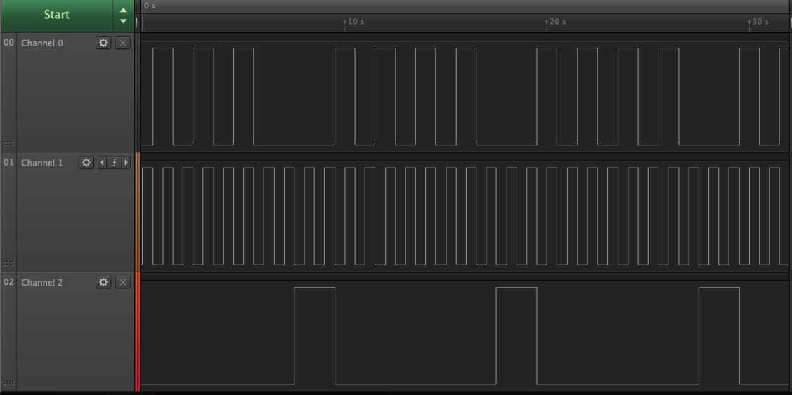
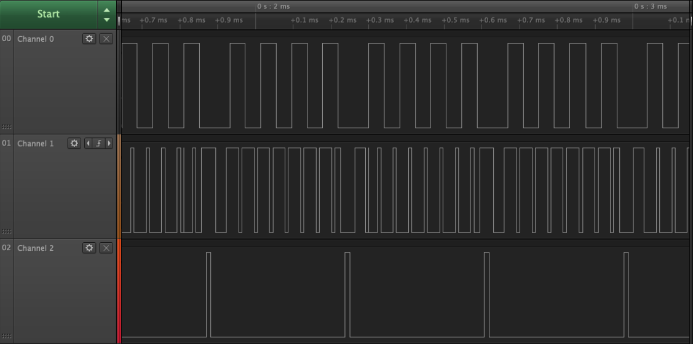

# P2_Chavez_Correa

Se utilizó la Board FRDM-K66 con los siguinetes pines de salidaen el Puerto B:

PTB2->Chip Select

PTB3-> CLK

PTB4-> MOSI

Se muestra una captura de pantalla del analizador lógico de la implementación que se realizó a 1Hz:

Donde:

Channel 0: MOSI

Channel 1: CLK

Channel 2:CS

En todos los bytes se está mandando el dato 0xAA

Se probaron otras frecuencias de operación y no funciona de la manera esperada, se muestra lo obtenido a continuación:

Por lo que no se asegura la correcta operación fuera de esta frecuencia.
